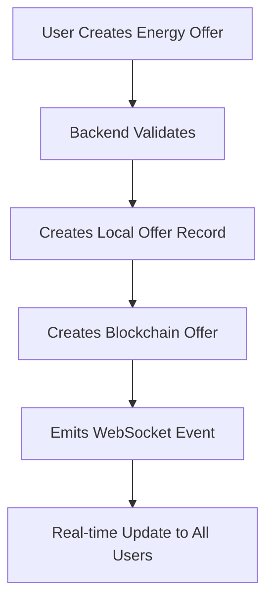
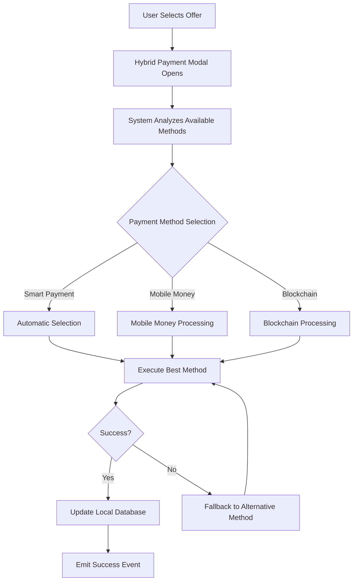

# Enerlectra Hybrid Payment System

## Overview

The Enerlectra platform implements a **hybrid payment system** that seamlessly combines blockchain technology with traditional mobile money payments. This system makes blockchain completely invisible to end users while providing the benefits of decentralized energy trading, security, and transparency.

## 🎯 Key Principles

### 1. **User Experience First**
- Users never need to understand blockchain technology
- Payment methods are automatically selected based on availability and user preferences
- Seamless fallback between payment methods if one fails

### 2. **Blockchain Under the Hood**
- All energy trades are recorded on the blockchain for transparency and immutability
- Smart contracts handle energy token transfers and payment settlements
- Real-time synchronization between blockchain and local database

### 3. **Hybrid Payment Intelligence**
- **Smart Payment**: Automatically selects the best payment method
- **Mobile Money**: MTN, Airtel, Zamtel integration for African users
- **Digital Wallet**: Blockchain-based payments for advanced users
- **Automatic Fallback**: If blockchain fails, falls back to mobile money

## 🏗️ System Architecture

### Backend Services

#### Blockchain Service (`src/services/blockchainService.ts`)
```typescript
class BlockchainService {
  // Core blockchain operations
  async createEnergyOffer(sellerAddress, energyAmount, pricePerKwh, acceptMobileMoney)
  async executeTradeWithBlockchain(offerId, buyerAddress)
  async executeTradeWithMobileMoney(offerId, buyerPhone, mobileMoneyReference)
  async processHybridPayment(request) // Main entry point
  
  // Real-time event listeners
  private setupEventListeners() // Listens for blockchain events
  private syncOfferToDatabase() // Syncs blockchain data to local DB
}
```

#### Blockchain Routes (`src/routes/blockchain.ts`)
```typescript
// Main hybrid payment endpoint
POST /blockchain/trade/execute
// Automatic payment method selection and execution

// Specific payment method endpoints
POST /blockchain/trade/blockchain
POST /blockchain/trade/mobile-money

// Status and health endpoints
GET /blockchain/status
GET /blockchain/health
POST /blockchain/sync
```

### Frontend Components

#### Hybrid Payment Modal (`client/src/components/HybridPaymentModal.tsx`)
- **Smart Payment Selection**: Automatically recommends the best payment method
- **Payment Method Options**: Shows available methods with processing times and fees
- **Real-time Processing**: Live updates during payment processing
- **Automatic Fallback**: Seamlessly switches methods if one fails

#### Blockchain Status Panel (`client/src/components/BlockchainStatusPanel.tsx`)
- **System Health**: Shows blockchain service status
- **Feature Availability**: Displays which hybrid payment features are active
- **Real-time Sync**: Manual and automatic blockchain data synchronization
- **User Education**: Explains how the system works without technical jargon

## 🔄 Payment Flow

### 1. **Offer Creation**


### 2. **Hybrid Payment Processing**


### 3. **Automatic Fallback System**
```typescript
async processHybridPayment(request: HybridPaymentRequest) {
  // 1. Check user wallet connection
  const hasWallet = await this.checkUserWalletConnection(request.userId);
  
  // 2. Auto-detect best payment method
  if (request.paymentMethod === 'hybrid') {
    if (hasWallet && await this.checkBlockchainPaymentAvailability(request)) {
      request.paymentMethod = 'blockchain';
    } else {
      request.paymentMethod = 'mobile_money';
    }
  }
  
  // 3. Execute selected method
  if (request.paymentMethod === 'blockchain') {
    const result = await this.executeTradeWithBlockchain(offerId, buyerId);
    if (!result.success) {
      // Fallback to mobile money
      request.paymentMethod = 'mobile_money';
    }
  }
  
  // 4. Execute fallback if needed
  if (request.paymentMethod === 'mobile_money') {
    return await this.executeTradeWithMobileMoney(offerId, buyerPhone, reference);
  }
}
```

## 🚀 Smart Contract Integration

### Energy Trading Contract
```solidity
contract EnergyTrading {
    // Create energy offer with mobile money support
    function createEnergyOffer(
        uint256 energyAmount,
        uint256 pricePerKwh,
        uint256 expiresAt,
        bool acceptMobileMoney
    ) external returns (uint256);
    
    // Execute trade with blockchain payment
    function executeTradeWithBlockchain(uint256 offerId) external returns (uint256);
    
    // Execute trade with mobile money
    function executeTradeWithMobileMoney(
        uint256 offerId,
        string buyer,
        string mobileMoneyRef
    ) external returns (uint256);
    
    // Process mobile money payment and credit energy
    function processMobileMoneyPayment(
        address user,
        string mobileMoneyRef,
        uint256 energyAmount
    ) external;
}
```

### Event Emission
```solidity
event EnergyOfferCreated(
    uint256 indexed offerId,
    address indexed seller,
    uint256 energyAmount,
    uint256 pricePerKwh,
    bool isHybrid
);

event TradeExecuted(
    uint256 indexed tradeId,
    uint256 indexed offerId,
    address indexed buyer,
    address seller,
    uint256 energyAmount,
    uint256 totalPrice,
    uint8 paymentMethod
);

event MobileMoneyPaymentReceived(
    address indexed user,
    string reference,
    uint256 amount,
    uint256 energyCredits
);
```

## 🔌 Real-time Updates

### WebSocket Events
```typescript
// Backend emits events after blockchain operations
io.to('trading-public').emit('offer-created', {
  offerId: newOffer.id,
  fromUserId: newOffer.fromUserId,
  energyAmount: newOffer.energyAmount,
  pricePerKwh: newOffer.pricePerKwh,
  tradeType: newOffer.tradeType,
  timestamp: newOffer.createdAt
});

io.to(`trading-${buyer.id}`).emit('trade-completed', {
  offerId: offer.id,
  type: 'buy',
  amount: offer.energyAmount,
  cost: offer.totalPrice,
  paymentMethod: result.paymentMethod,
  timestamp: transaction.timestamp
});
```

### Frontend Event Listeners
```typescript
useEffect(() => {
  const handleTradeCompleted = (event: CustomEvent) => {
    const { type, amount, cost, paymentMethod } = event.detail;
    toast.success(`${type === 'buy' ? 'Purchased' : 'Sold'} ${amount} kWh for ${cost.toFixed(2)} ZMW using ${paymentMethod}`, {
      duration: 5000,
      icon: '⚡',
    });
    fetchMarketData(); // Refresh market data
  };

  window.addEventListener('trade-completed', handleTradeCompleted as EventListener);
  return () => window.removeEventListener('trade-completed', handleTradeCompleted as EventListener);
}, []);
```

## 📱 Mobile Money Integration

### Supported Providers
- **MTN Mobile Money**: Zambia's largest mobile money provider
- **Airtel Money**: Second largest mobile money service
- **Zamtel Kwacha**: Government-owned telecom provider

### Payment Flow
```typescript
// 1. User initiates mobile money payment
const result = await apiService.executeMobileMoneyTrade({
  offerId: offer.id,
  buyerPhone: phoneNumber,
  mobileMoneyReference: `MM-${Date.now()}`
});

// 2. Backend processes payment
const mobileMoneyResult = await mobileMoneyService.processPayment({
  phoneNumber,
  amount: offer.totalPrice,
  reference: mobileMoneyReference,
  provider: 'MTN' // Auto-detected from phone number
});

// 3. Blockchain records the transaction
await blockchainService.processMobileMoneyPayment(
  userAddress,
  mobileMoneyReference,
  offer.energyAmount
);

// 4. User receives energy credits instantly
```

## 🔒 Security Features

### 1. **JWT Authentication**
- HTTP-only cookies for secure token storage
- Automatic token refresh
- Device fingerprinting for session security

### 2. **Rate Limiting**
- API endpoint protection
- Mobile money transaction limits
- Blockchain transaction throttling

### 3. **Signature Verification**
- Mobile money webhook validation
- Blockchain transaction signing
- Payment method verification

### 4. **Idempotency**
- Unique transaction references
- Duplicate payment prevention
- Atomic transaction processing

## 📊 Monitoring and Analytics

### Blockchain Health Monitoring
```typescript
// Health check endpoint
GET /blockchain/health
{
  "success": true,
  "data": {
    "service": "blockchain",
    "status": "healthy",
    "blockchain": {
      "isInitialized": true,
      "network": "polygon",
      "blockNumber": 12345678
    },
    "timestamp": "2024-01-15T10:30:00Z",
    "message": "Blockchain service is operational"
  }
}
```

### Real-time Status Dashboard
- Blockchain service status
- Network connectivity
- Block synchronization
- Feature availability
- Last sync timestamp

## 🚀 Deployment and Configuration

### Environment Variables
```bash
# Blockchain Configuration
BLOCKCHAIN_RPC_URL=https://polygon-rpc.com
BLOCKCHAIN_CHAIN_ID=137
BLOCKCHAIN_PRIVATE_KEY=your_private_key
ENERGY_TOKEN_ADDRESS=0x...
ENERGY_TRADING_ADDRESS=0x...
PAYMENT_TOKEN_ADDRESS=0x...

# JWT Configuration
JWT_SECRET=your_jwt_secret
REFRESH_SECRET=your_refresh_secret

# Mobile Money Configuration
MTN_API_KEY=your_mtn_api_key
AIRTEL_API_KEY=your_airtel_api_key
ZAMTEL_API_KEY=your_zamtel_api_key
```

### Smart Contract Deployment
```bash
# Deploy to Polygon mainnet
npx hardhat run scripts/deploy.js --network polygon

# Verify contracts on Polygonscan
npx hardhat verify --network polygon CONTRACT_ADDRESS
```

## 🎉 Benefits for African Users

### 1. **Financial Inclusion**
- No bank account required
- Mobile money integration
- Low transaction fees
- Instant settlements

### 2. **Energy Access**
- Democratized energy trading
- Peer-to-peer energy markets
- Renewable energy incentives
- Carbon credit tracking

### 3. **Economic Empowerment**
- Local energy production
- Income generation opportunities
- Reduced energy costs
- Community energy sharing

### 4. **Technology Transparency**
- Blockchain benefits without complexity
- Transparent pricing
- Immutable transaction records
- Real-time market data

## 🔮 Future Enhancements

### 1. **Advanced AI Integration**
- Payment method optimization
- Fraud detection
- Market prediction
- User behavior analysis

### 2. **Cross-Chain Support**
- Multiple blockchain networks
- Layer 2 scaling solutions
- Interoperability protocols
- Cross-chain energy trading

### 3. **Enhanced Mobile Experience**
- USSD integration
- SMS notifications
- Mobile app development
- Offline payment support

### 4. **Regulatory Compliance**
- KYC/AML integration
- Tax reporting
- Regulatory reporting
- Compliance monitoring

## 📚 API Documentation

### Hybrid Payment Endpoints

#### Execute Hybrid Trade
```http
POST /api/blockchain/trade/execute
Content-Type: application/json

{
  "offerId": "offer_123",
  "buyerId": "user_456",
  "phoneNumber": "+260XXXXXXXXX",
  "paymentMethod": "hybrid"
}
```

#### Get Blockchain Status
```http
GET /api/blockchain/status
Authorization: Bearer <jwt_token>
```

#### Sync Blockchain Data
```http
POST /api/blockchain/sync
Authorization: Bearer <jwt_token>
```

## 🛠️ Development Setup

### Prerequisites
- Node.js 18+
- Hardhat development environment
- Polygon testnet account
- Mobile money API credentials

### Installation
```bash
# Install dependencies
npm install

# Install blockchain dependencies
npm install ethers hardhat @openzeppelin/contracts

# Setup environment
cp .env.example .env
# Configure blockchain and mobile money settings

# Deploy smart contracts
npx hardhat run scripts/deploy.js --network polygon_testnet

# Start development server
npm run dev
```

### Testing
```bash
# Run blockchain tests
npx hardhat test

# Run API tests
npm run test:api

# Run integration tests
npm run test:integration
```

## 🤝 Contributing

### Development Guidelines
1. **User Experience First**: Always prioritize user experience over technical complexity
2. **Blockchain Invisible**: Keep blockchain implementation details hidden from end users
3. **Mobile Money Priority**: Ensure mobile money works seamlessly for African users
4. **Security First**: Implement robust security measures for all payment methods
5. **Real-time Updates**: Provide instant feedback for all user actions

### Code Standards
- TypeScript for type safety
- Comprehensive error handling
- Real-time event emission
- Automatic fallback mechanisms
- Comprehensive logging and monitoring

---

## 📞 Support

For technical support or questions about the hybrid payment system:

- **Email**: support@enerlectra.zm
- **Documentation**: [docs.enerlectra.zm](https://docs.enerlectra.zm)
- **GitHub**: [github.com/enerlectra](https://github.com/enerlectra)

---

*This system makes blockchain technology completely invisible to users while providing all the benefits of decentralized energy trading, security, and transparency.* 