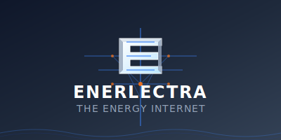

# ⚡ Enerlectra - The Energy Internet

> **Connecting energy producers and consumers through The Energy Internet**

[](https://enerlectra.vercel.app)

## Version

This repository is currently frozen at **Enerlectra v0.1.0-demo (Kabwe)** for the Week 8 demonstration.  
The Enerlectra core module in this repo powers a Kabwe community energy demo that computes contributions, ownership, and surplus distributions for a single cluster.

The following behaviors of the Enerlectra core are considered **frozen** in this demo:

- Recording contributions in the Kabwe cluster ledger  
- Computing participant ownership percentages in the cluster  
- Running simulations of generation, consumption, and surplus  
- Computing surplus/deficit allocations per participant  

Any future changes must not silently change these behaviors without a new version and tag.

## Fees

The Kabwe demo uses the fee schedule defined in `fees/fees-v1.json`.  
For **Enerlectra v0.1.0-demo (Kabwe)** all fees are set to **zero**; the file exists to show how fees will be versioned and communicated in future versions.

## Participation agreement

The Kabwe demo uses the community participation agreement defined in `contracts/participation-v1.md`.  
Enerlectra records contributions and computes ownership and surplus allocations according to that agreement; it does not assign legal ownership by itself.

---

## 🌟 Vision & Mission

**Enerlectra** is Africa's premier energy trading platform that revolutionizes how energy is bought, sold, and distributed across the continent. We're building **The Energy Internet** – a decentralized, blockchain-powered network that connects energy producers and consumers with unprecedented efficiency and transparency.

### 🎯 Our Mission

- **Democratize Energy Access**: Make energy trading accessible to everyone  
- **Enable Renewable Integration**: Accelerate the adoption of clean energy sources  
- **Build Energy Infrastructure**: Create the digital backbone for Africa's energy future  
- **Foster Economic Growth**: Drive economic development through energy innovation  

## 🚀 Key Features

### 🔐 **Enterprise-Grade Security**

- Military-grade security with quantum-resistant cryptography  
- Multi-factor authentication (MFA) with biometric support  
- Zero-trust network architecture  
- AI-powered threat detection and monitoring  
- Quantum blockchain security  

### ⚡ **Real-Time Energy Trading**

- Live energy marketplace with real-time pricing  
- Blockchain-powered transactions for transparency  
- WebSocket connections for instant updates  
- AI-powered market insights and predictions  
- Mobile money integration for seamless payments  

### 🌍 **African-Focused Solutions**

- Localized for African energy markets  
- Support for multiple currencies (ZMW, USD, EUR)  
- Mobile-first design for widespread accessibility  
- Offline-capable PWA for unreliable connections  
- Multi-language support (English, French, Portuguese)  

## 🏗️ Architecture

### Frontend (React + TypeScript)

```
client/
├── src/
│   ├── components/
│   │   ├── EnerlectraLogo.tsx      # Animated logo component
│   │   ├── LoadingScreen.tsx       # Branded loading experience
│   │   ├── EnhancedLoginModal.tsx  # Multi-auth methods
│   │   └── AIInsightsPanel.tsx     # AI-powered insights
│   ├── contexts/
│   │   ├── AuthContext.tsx         # Authentication management
│   │   └── SocketContext.tsx       # WebSocket connections
│   └── services/
│       └── api.ts                  # API integration
```

### Backend (Node.js + Express)

```
src/
├── config/
│   └── security.ts                 # Military-grade security config
├── middleware/
│   └── securityMiddleware.ts       # Security enforcement
├── routes/
│   ├── auth.ts                     # Authentication endpoints
│   ├── trade.ts                    # Trading operations
│   ├── ai.ts                       # AI insights
│   ├── mobilemoney.ts              # Mobile money integration
│   └── blockchain.ts               # Blockchain operations
└── services/
    └── blockchainService.ts        # Blockchain integration
```

## 🎨 Brand Identity

### Logo Design

Our logo represents the fusion of energy and technology:

- **3D Stylized "E"**: Symbolizing energy, efficiency, and excellence  
- **Circuit Board Pattern**: Representing the digital infrastructure  
- **Energy Nodes**: Glowing orange dots showing active connections  
- **Blue Energy Flow**: Dynamic lines representing data and energy transfer  

### Color Palette

- **Primary Blue**: `#3b82f6` – Trust, technology, energy  
- **Secondary Orange**: `#f97316` – Innovation, creativity, warmth  
- **Dark Slate**: `#0f172a` – Professionalism, stability  
- **Light Blue**: `#e0f2fe` – Clarity, transparency  

### Typography

- **Primary Font**: Inter – Modern, readable, professional  
- **Logo Font**: Custom geometric sans-serif for brand recognition  

## 🚀 Getting Started

### Prerequisites

- Node.js 18+  
- npm or yarn  
- Git  

### Frontend Setup

```
cd client
npm install
npm run dev
```

### Backend Setup

```
npm install
npm run dev
```

### Environment Variables

Create `.env` files in both root and client directories:

```
# Backend (.env)
NODE_ENV=development
PORT=5000
JWT_SECRET=your-super-secret-jwt-key
CORS_ORIGINS=http://localhost:3000,https://enerlectra.vercel.app

# Frontend (.env)
VITE_API_URL=http://localhost:5000
VITE_WS_URL=ws://localhost:5000
```

## 🧪 Testing

### Frontend Tests

```
cd client
npm run test              # Run all tests
npm run test:auth         # Authentication tests only
npm run test:coverage     # With coverage report
```

### Backend Tests

```
npm run test              # Run all tests
npm run test:security     # Security tests only
npm run test:api          # API endpoint tests
```

### Comprehensive Testing

```
cd client
npm run test:all          # Frontend + Backend + Security
```

## 🌐 Deployment

### Vercel (Frontend)

```
cd client
vercel --prod
```

### Railway/Heroku (Backend)

```
git push heroku main
```

## 🔐 Security Features

### Authentication Methods

- **Phone Authentication**: SMS-based verification  
- **Email Authentication**: Magic link and OTP  
- **Social Login**: Google, Facebook, Apple  
- **Biometric Authentication**: Fingerprint, Face ID  
- **Guest Mode**: Limited access for exploration  

### Security Measures

- **Rate Limiting**: Advanced DDoS protection  
- **Input Validation**: Comprehensive sanitization  
- **SQL Injection Protection**: Parameterized queries  
- **XSS Prevention**: Content Security Policy  
- **CSRF Protection**: Token-based validation  

## 📱 PWA Features

- **Offline Capability**: Works without internet  
- **App Installation**: Install as native app  
- **Push Notifications**: Real-time updates  
- **Background Sync**: Data synchronization  
- **Responsive Design**: Mobile-first approach  

## 🤝 Contributing

We welcome contributions! Please see our [Contributing Guide](CONTRIBUTING.md) for details.

### Development Workflow

1. Fork the repository  
2. Create a feature branch  
3. Make your changes  
4. Add tests  
5. Submit a pull request  

## 📄 License

This project is licensed under the MIT License – see the [LICENSE](LICENSE) file for details.

## 🌟 Acknowledgments

- **African Energy Community**: For inspiration and feedback  
- **Blockchain Community**: For technological innovation  
- **Open Source Contributors**: For building the future together  

## 📞 Contact

- **Website**: https://enerlectra.vercel.app  
- **Email**: info@enerlectra.com  
- **Twitter**: https://twitter.com/Enerlectra  
- **LinkedIn**: https://linkedin.com/company/enerlectra  

---

<div align="center">

**⚡ Powered by The Energy Internet ⚡**

*Connecting Africa's energy future, one trade at a time*

[](https://enerlectra.vercel.app)

</div>
